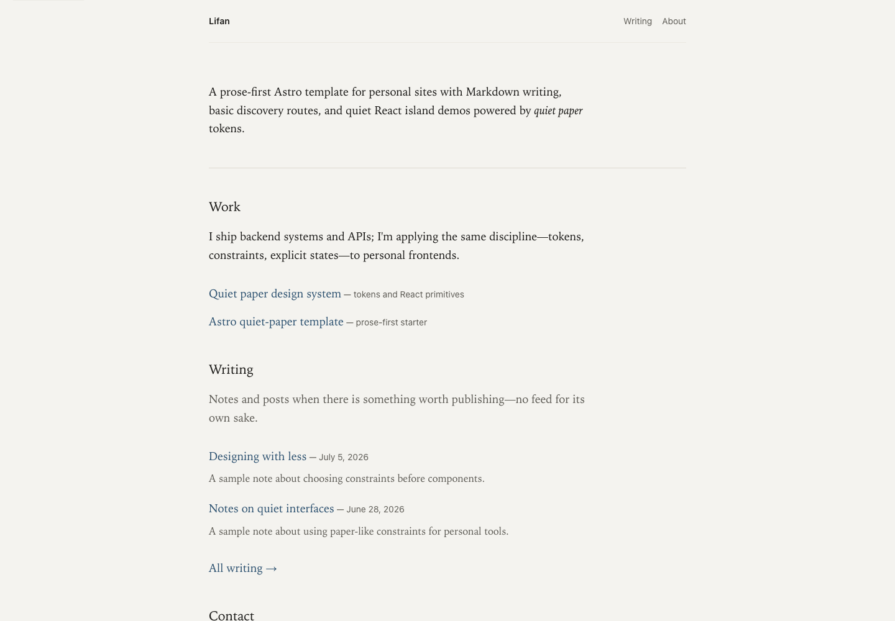

# astro-quiet-paper

[](https://deploy.workers.cloudflare.com/?url=https://github.com/lifanh/astro-quiet-paper)

**Live preview:** <https://astro-quiet-paper.lifanh.workers.dev/>

Astro **template** for a prose-first personal site: static pages, Markdown writing, and a hidden React island demo styled with [`@lifanh/quiet-paper`](https://www.npmjs.com/package/@lifanh/quiet-paper).

**Quiet paper:** warm off-white, ink-like type, hairline borders, one restrained accent — no dashboard chrome.



## Stack

| Layer | Choice |
|--------|--------|
| Static | Astro 7 |
| Writing | Astro content collections + Markdown |
| Islands | React 19 + `@astrojs/react` |
| Styles | Tailwind CSS v4 + design system tokens |
| Discovery | RSS, sitemap, robots |

## Quick start

```bash
git clone git@github.com:lifanh/astro-quiet-paper.git my-site
cd my-site
npm install
npm run dev
```

Open `http://localhost:4321`.

Before deploying, replace the template identity and URL in `src/site.ts` and `astro.config.mjs`.

## Writing

Posts live in `src/content/posts/*.md`:

```md
---
title: "Designing with less"
description: "Short summary for lists and SEO."
date: 2026-07-05
tags: ["design", "systems"]
draft: false
---
```

Routes included:

- `/writing` — all non-draft posts
- `/writing/[...slug]` — individual posts
- `/rss.xml` — feed for non-draft posts
- `/robots.txt` and `/sitemap-index.xml` — crawler discovery

The homepage automatically shows the latest three non-draft posts.

Fenced `mermaid` code blocks are rendered to inline SVG at build time. The original Mermaid source remains available under each diagram’s “Mermaid source” disclosure. Generated SVGs are cached in `src/generated/mermaid/`; commit those files so Cloudflare Workers Builds can render the site without launching Chromium on every deploy. Locally, `npm run build` generates or repairs missing/invalid cache files before Astro starts. In CI/Workers Builds, it checks that every Mermaid fence under `src/` has a committed, complete SVG before Astro starts.

## Design system setup

Tokens and utilities come from the package (Tailwind v4 Pattern A). Already wired in `src/styles/global.css`:

```css
@import "tailwindcss";
@plugin "@tailwindcss/typography";
@import "@lifanh/quiet-paper/styles/tailwind-sources.css";
@import "@lifanh/quiet-paper/styles/tokens.css" layer(theme);
@import "@lifanh/quiet-paper/styles/tailwind-theme.css";
```

Components in React islands and rendered Markdown pages:

```tsx
import { Panel, Button, Prose } from "@lifanh/quiet-paper";
```

The developer demo route stays at `/demo`, but it is intentionally not linked from the site chrome.

## Customize

| File | What to change |
|------|----------------|
| `src/site.ts` | Site name, public URL, nav, default meta |
| `astro.config.mjs` | Astro `site` URL for sitemap/canonical output |
| `src/pages/index.astro` | Homepage copy (Work / Writing / Contact) |
| `src/content/pages/about.md` | About page copy |
| `src/content/posts/*.md` | Writing entries |
| `src/generated/mermaid/*.svg` | Build-time rendered Mermaid diagrams |
| `src/demo/*` | Demo composites — copy patterns, don’t fork primitives |

Primitives (`Button`, `Field`, `ErrorState`, …) live in the **design system repo**, not here.

## Project layout

```text
src/
├── components/                # site chrome (header, footer)
├── demo/                      # React islands for /demo only
├── content/pages/about.md     # Markdown-backed About page
├── content/posts/             # Markdown writing
├── content.config.ts          # page/post frontmatter schemas
├── layouts/BaseLayout.astro   # shell + global meta + CSS
├── lib/posts.ts               # writing helpers
├── lib/markdown/mermaid.js    # build-time Mermaid renderer/cache check
├── pages/                     # routes, RSS, robots
├── generated/mermaid/         # committed SVG cache for Mermaid fences
├── site.ts                    # nav + metadata
└── styles/global.css          # Tailwind + DS imports
```

## Commands

| Command | Action |
|---------|--------|
| `npm run dev` | Dev server `:4321` |
| `npm run lint` | Oxlint source checks |
| `npm run check` | Astro + TypeScript diagnostics |
| `npm run build` | Static `dist/` |
| `npm run mermaid:prune` | Remove stale generated Mermaid SVGs |
| `npm run preview` | Preview production build |

## Deploy

### Deploy to Cloudflare Workers (one click)

Use the **Deploy to Cloudflare** button above (or open the [deploy flow](https://deploy.workers.cloudflare.com/?url=https://github.com/lifanh/astro-quiet-paper)). Cloudflare will fork the repo into your GitHub account, connect **Workers Builds**, and deploy static assets from `dist/` using [`wrangler.jsonc`](wrangler.jsonc).

Suggested build settings (usually auto-detected):

| Setting | Value |
|---------|--------|
| Build command | `npm run build` |
| Deploy command | `npx wrangler deploy` |

If your site includes Mermaid diagrams, commit `src/generated/mermaid/*.svg` after a local build. If Cloudflare Workers Builds sees a new Mermaid block without a cached SVG, the build fails with instructions instead of silently omitting the diagram.

CI/Workers Builds skip Puppeteer’s browser download because they only validate committed SVGs. If a local build needs to render a new diagram and Puppeteer reports a missing browser, run `npx puppeteer browsers install chrome-headless-shell`, then run `npm run build` again. If you change the Mermaid renderer or theme, run `npm run build` to refresh SVG cache files, then run `npx astro build --force` once so Astro does not reuse old rendered Markdown from its content cache. After editing or removing diagrams, run `npm run mermaid:prune` to drop orphaned SVG cache files.

After the first deploy, set your public URL in `src/site.ts` and `astro.config.mjs` so RSS, sitemap, and canonical links are correct.

Local equivalent:

```bash
npm run deploy
```

### Other static hosts

Cloudflare Pages, Vercel, Netlify: build command `npm run build`, output directory `dist/`.

Set the same production URL in `src/site.ts` and `astro.config.mjs` before publishing.

## Related repos

- **Design system:** [quiet-paper](https://github.com/lifanh/quiet-paper) → npm `@lifanh/quiet-paper`
- **Learning notes (optional):** your own `my-minimalism` or design journal — not required to run this template

## License

MIT — fork and replace “Lifan” with your name in `src/site.ts`.
