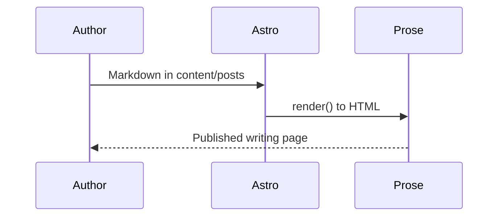

Use this note when you want to see how Markdown turns into a finished article on this template. Everything below is ordinary Markdown (plus a few explicit HTML callouts) rendered inside `@lifanh/quiet-paper` **Prose** on `/writing/[...slug]`.

## Headings and body text

Paragraphs use a comfortable measure and relaxed line height. **Strong emphasis** stays in the ink color; *italic* inherits the same rhythm. Inline `code` gets a hairline border and surface background.

A second paragraph shows the default spacing between blocks. Links behave like the rest of the site: [Writing index](/writing), [About](/about), or an [external reference](https://docs.astro.build/en/guides/markdown-content/).

### Third-level heading

#### Fourth-level heading

##### Fifth-level heading

###### Sixth-level heading

---

## Lists

Unordered lists use muted markers and tight vertical rhythm:

- One column, one accent, links that carry expression
- Nested items when structure matters
  - Inner item with **bold** label
  - Another inner item
- A closing top-level item

Ordered steps read cleanly in demos and runbooks:

1. Add a file under `src/content/posts/`
2. Fill frontmatter: `title`, `description`, `date`
3. Run `npm run dev` and open `/writing/your-slug`

Task lists (GFM) align with accent checkboxes when your pipeline preserves task-list markup:

- [x] Publish non-draft posts to `/writing`
- [x] Wrap post body in `Prose`
- [ ] Replace sample copy with your own voice

## Blockquote

> Quiet interfaces borrow from documents: one clear column, restrained navigation, and states that feel like marginal notes rather than billboards.

## Code blocks

Fenced blocks use Shiki highlighting and surface panels:

```ts
import { getPublishedPosts, postPath } from "../lib/posts";

const posts = await getPublishedPosts();
posts.map((post) => postPath(post));
```

```bash
npm run dev
npm run build
```

## Table

| Element | Role in this template |
| ------- | --------------------- |
| `Prose` | Typography + quiet-paper modifiers for rendered HTML |
| Frontmatter | Title, description, date, tags, optional `draft` |
| Mermaid fences | Build-time SVG diagrams with optional source disclosure |

## Diagram (Mermaid)



## Callouts (HTML)

Callouts use explicit classes documented in the design system:

<aside class="qp-callout qp-callout-note">
<p><strong>Note.</strong> Parser transforms for callout syntax live in the host app; classes are stable in <code>@lifanh/quiet-paper</code>.</p>
</aside>

<aside class="qp-callout qp-callout-warning">
<p><strong>Warning.</strong> Commit generated Mermaid SVGs before deploying to Workers Builds.</p>
</aside>

<aside class="qp-callout qp-callout-error">
<p><strong>Error tone.</strong> Reserve for destructive or blocking guidance in real posts—not decoration.</p>
</aside>

## Inline semantics

Keyboard hints use <kbd>Cmd</kbd> + <kbd>K</kbd>. You can <mark>highlight a phrase</mark>, show <del>removed</del> copy, cite H<sub>2</sub>O or x<sup>2</sup>, and fold optional detail:

<details>
<summary>Collapsed section</summary>

<p>Extra context without pushing the main argument below the fold.</p>
</details>

## Footnotes

Footnotes stay muted and separated from the body.[^preview]

[^preview]: Sample footnote for list pages and long-form notes.